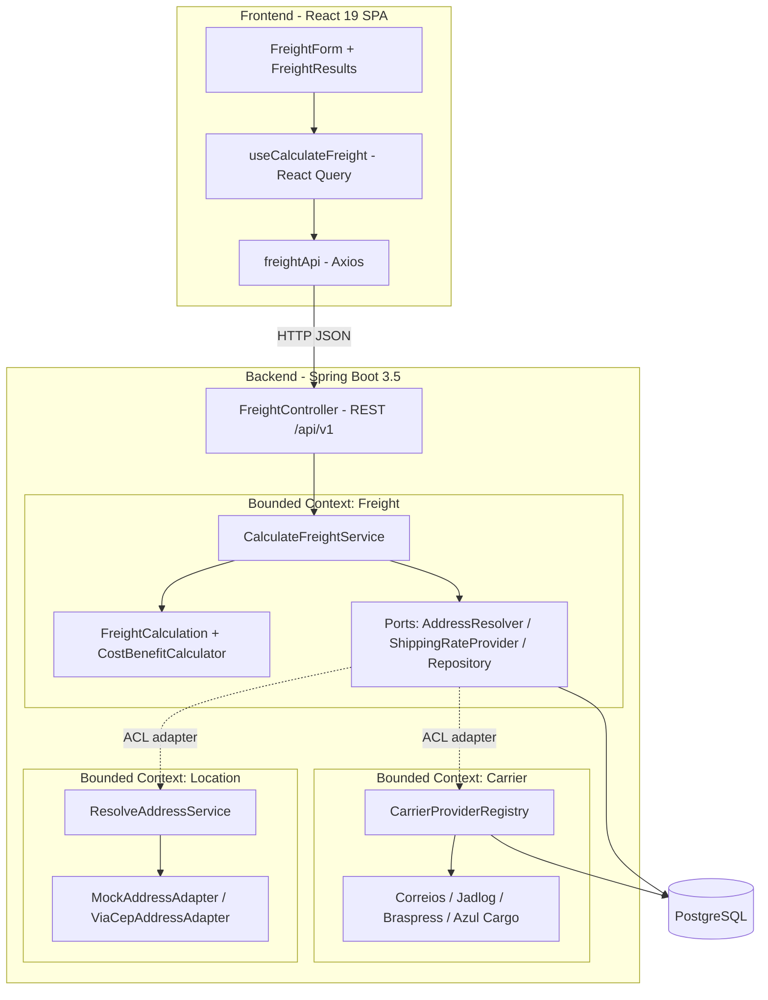
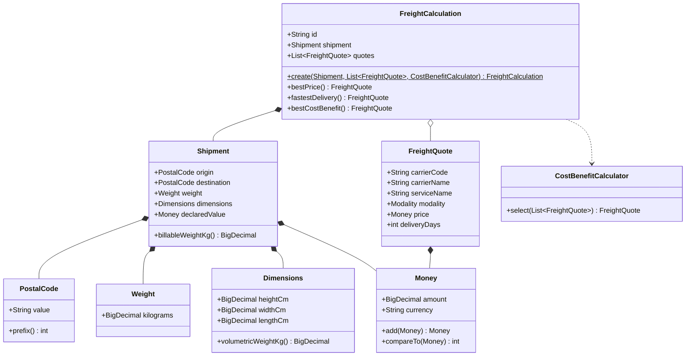
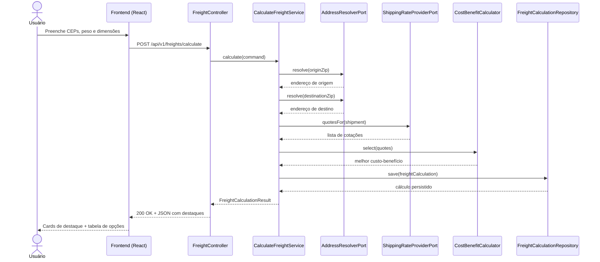

# Explicação video
[Explicação](https://drive.google.com/file/d/1xjA0Y-FxpWfGAHwfL9efFNOg_zC_DclZ/view?usp=sharing)

# Comparador de Fretes

Aplicação full stack para cálculo e comparação de fretes entre transportadoras, inspirada na experiência dos Correios (SEDEX/PAC). O usuário informa origem, destino e as dimensões da encomenda e recebe as opções disponíveis, com destaque para a **mais barata**, a **mais rápida** e a de **melhor custo-benefício**.

O projeto é dividido em dois módulos independentes:

- **`freight-comparator-backend`** — API REST em Java 21 + Spring Boot 3.5, modelada com DDD, Clean Architecture e Arquitetura Hexagonal.
- **`freight-comparator-frontend`** — SPA em React 19 + TypeScript + Vite, organizada por contextos de domínio (DDD no front).

---

## Sumário

- [Visão geral](#visão-geral)
- [Arquitetura](#arquitetura)
- [Diagrama de componentes](#diagrama-de-componentes)
- [Diagrama de classes (domínio Freight)](#diagrama-de-classes-domínio-freight)
- [Diagrama de sequência (cálculo de frete)](#diagrama-de-sequência-cálculo-de-frete)
- [Stack tecnológica](#stack-tecnológica)
- [Estrutura de pastas](#estrutura-de-pastas)
- [Como executar](#como-executar)
- [Endpoints da API](#endpoints-da-api)
- [Regras de negócio](#regras-de-negócio)
- [Transportadoras e serviços](#transportadoras-e-serviços)
- [Testes](#testes)
- [Decisões técnicas](#decisões-técnicas)

---

## Visão geral

O sistema resolve os endereços de origem e destino a partir do CEP, monta uma encomenda (`Shipment`) com peso e dimensões, consulta as transportadoras cadastradas por meio de provedores (Strategy Pattern) e calcula uma cotação por serviço. Em cima das cotações, o domínio determina os três destaques e persiste o histórico do cálculo.

O provedor padrão é um **mock determinístico**, o que torna o resultado reproduzível e independente de integrações externas. A arquitetura, porém, já expõe pontos de extensão para provedores reais (por exemplo, um adapter ViaCEP para resolução de endereço já acompanha o projeto).

---

## Arquitetura

O backend segue **DDD + Clean Architecture + Hexagonal (Ports & Adapters)**, com três *bounded contexts* isolados:

| Contexto | Responsabilidade |
| --- | --- |
| **Freight** | Núcleo do negócio: encomenda, cotações, cálculo dos destaques e persistência do histórico. |
| **Location** | Resolução de endereço a partir do CEP. |
| **Carrier** | Cadastro de transportadoras e geração de cotações via provedores. |

Cada contexto é dividido em quatro camadas:

- **domain** — entidades, *value objects*, serviços de domínio, portas e exceções. Sem dependência de framework.
- **application** — casos de uso (orquestração), DTOs e portas de entrada/saída.
- **infrastructure** — adaptadores: persistência (JPA), provedores e configuração de beans.
- **interfaces** — camada web (controllers e DTOs de request/response).

A regra de dependência é sempre **de fora para dentro**: `interfaces` e `infrastructure` dependem de `application` e `domain`; o `domain` não depende de ninguém. A integração entre contextos é feita por **adapters anticorrupção** dentro da infraestrutura do contexto Freight, de modo que nenhum tipo de um contexto vaze para o outro.

No frontend a mesma filosofia é aplicada: a pasta `src` é dividida em `shared`, `location`, `carrier` e `freight`, e este último contém `domain`, `application`, `infrastructure` e `presentation`.

### Diagrama de componentes



### Diagrama de classes (domínio Freight)



### Diagrama de sequência (cálculo de frete)



## Stack tecnológica

### Backend

| Item | Tecnologia |
| --- | --- |
| Linguagem | Java 21 |
| Framework | Spring Boot 3.5 (Spring Framework 6.2, Jakarta EE 10, Jackson 2) |
| Build | Maven |
| Módulos Spring | Web, Data JPA, Validation, Actuator |
| Documentação | springdoc-openapi 2.8.x (Swagger UI · OpenAPI 3) |
| Banco de dados | PostgreSQL |
| Migrations | Flyway |
| Concorrência | Virtual Threads (Project Loom) |

### Frontend

| Item | Tecnologia |
| --- | --- |
| Biblioteca | React 19 |
| Linguagem | TypeScript |
| Bundler | Vite 6 |
| Dados/cache | TanStack React Query 5 |
| Formulário | React Hook Form + Zod |
| HTTP | Axios |
| Estilo | Tailwind CSS 3 |
| UI | Componentes no estilo shadcn/ui (escritos à mão com CVA) |
| Servidor (container) | Arquivos estáticos via `serve` (sem nginx) |
| Testes | Vitest + Testing Library |

---

## Estrutura de pastas

```
freight-comparator/
├── docker-compose.yml
├── .env.example
├── freight-comparator-backend/
│   ├── pom.xml
│   ├── Dockerfile
│   └── src/
│       └── main/
│           ├── java/com/freightcomparator/
│           │   ├── config/
│           │   ├── freight/        (domain · application · infrastructure · interfaces)
│           │   ├── location/       (domain · application · infrastructure · interfaces)
│           │   └── carrier/        (domain · application · infrastructure · interfaces)
│           └── resources/
│               ├── application.yml
│               └── db/migration/   (V1, V2, V3)
└── freight-comparator-frontend/
    ├── package.json
    ├── vite.config.ts
    ├── Dockerfile          (build + servidor estático, sem nginx)
    └── src/
        ├── shared/    (lib · api · query · ui)
        ├── location/  (domain)
        ├── carrier/   (domain)
        ├── freight/   (domain · application · infrastructure · presentation)
        └── test/      (Vitest)
```

---

## Como executar

### Opção 1 — Docker Compose (recomendado)

Sobe banco de dados, backend e frontend de uma vez:

```bash
docker compose up --build
```

| Serviço | URL |
| --- | --- |
| Frontend | http://localhost:3000 |
| API (backend) | http://localhost:8080/api/v1 |
| Swagger UI | http://localhost:8080/swagger-ui.html |
| Health check | http://localhost:8080/actuator/health |

> O frontend é servido como SPA estática por um servidor de arquivos leve (`serve`), sem nginx. A URL da API é injetada em **tempo de build** pela variável `VITE_API_URL`, definida como *build arg* no `docker-compose.yml` (padrão `http://localhost:8080/api`). Por isso, ao alterar o endereço do backend, reconstrua a imagem do frontend (`--build`). O CORS para `/api/**` já está habilitado no backend para permitir a chamada entre origens.

Para encerrar e remover o volume do banco:

```bash
docker compose down -v
```

### Opção 2 — Execução local separada

**Backend** (requer Java 21 e um PostgreSQL acessível):

```bash
cd freight-comparator-backend
./mvnw spring-boot:run
```

Variáveis de ambiente reconhecidas (com valores padrão entre parênteses): `SPRING_DATASOURCE_URL` (`jdbc:postgresql://localhost:5432/freight`), `SPRING_DATASOURCE_USERNAME` (`freight`), `SPRING_DATASOURCE_PASSWORD` (`freight`), `LOCATION_PROVIDER` (`mock`).

**Frontend** (requer Node 20+):

```bash
cd freight-comparator-frontend
npm install
npm run dev
```

O Vite sobe em `http://localhost:5173` e, em desenvolvimento, já encaminha as chamadas `/api` para `http://localhost:8080` via proxy — sem necessidade de configurar `VITE_API_URL`.

---

## Endpoints da API

Versionamento por URI sob o prefixo `/api/v1`.

| Método | Caminho | Descrição |
| --- | --- | --- |
| `POST` | `/api/v1/freights/calculate` | Calcula e compara o frete. |
| `GET` | `/api/v1/freights/history?limit=10` | Lista os cálculos mais recentes. |
| `GET` | `/api/v1/carriers` | Lista as transportadoras cadastradas. |
| `GET` | `/api/v1/locations/{zipCode}` | Resolve o endereço de um CEP. |

### Exemplo de requisição

```http
POST /api/v1/freights/calculate
Content-Type: application/json
```

```json
{
  "originZipCode": "01001-000",
  "destinationZipCode": "30130-010",
  "weight": 2.5,
  "height": 20,
  "width": 15,
  "length": 30,
  "declaredValue": 0
}
```

### Exemplo de resposta (valores ilustrativos do provedor mock)

```json
{
  "id": "0a2f8c1e-9b34-4f1e-9b2a-1c0d5e6f7a8b",
  "originZipCode": "01001-000",
  "destinationZipCode": "30130-010",
  "bestPrice": {
    "carrierCode": "CORREIOS",
    "carrierName": "Correios",
    "serviceName": "PAC",
    "modality": "ECONOMY",
    "price": 18.12,
    "currency": "BRL",
    "deliveryDays": 5,
    "bestPrice": true,
    "fastestDelivery": false,
    "bestCostBenefit": false
  },
  "fastestDelivery": {
    "carrierCode": "AZULCARGO",
    "carrierName": "Azul Cargo Express",
    "serviceName": "Expresso",
    "modality": "AIR",
    "price": 37.08,
    "currency": "BRL",
    "deliveryDays": 1,
    "bestPrice": false,
    "fastestDelivery": true,
    "bestCostBenefit": false
  },
  "bestCostBenefit": {
    "carrierCode": "JADLOG",
    "carrierName": "Jadlog",
    "serviceName": "Package",
    "modality": "ECONOMY",
    "price": 22.70,
    "currency": "BRL",
    "deliveryDays": 3,
    "bestPrice": false,
    "fastestDelivery": false,
    "bestCostBenefit": true
  },
  "options": [
    { "carrierCode": "CORREIOS", "serviceName": "SEDEX", "modality": "EXPRESS", "price": 33.74, "deliveryDays": 2 },
    { "carrierCode": "CORREIOS", "serviceName": "PAC", "modality": "ECONOMY", "price": 18.12, "deliveryDays": 5 },
    { "carrierCode": "JADLOG", "serviceName": "Package", "modality": "ECONOMY", "price": 22.70, "deliveryDays": 3 },
    { "carrierCode": "BRASPRESS", "serviceName": "Rodoviario", "modality": "ROAD", "price": 27.48, "deliveryDays": 3 },
    { "carrierCode": "AZULCARGO", "serviceName": "Expresso", "modality": "AIR", "price": 37.08, "deliveryDays": 1 }
  ],
  "calculatedAt": "2026-06-06T12:00:00Z"
}
```

Os erros seguem o padrão **ProblemDetail (RFC 7807)**. Por exemplo, um CEP em formato inválido retorna `400 Bad Request`; um CEP sem endereço retorna `404 Not Found`; e a ausência de cotações retorna `422 Unprocessable Entity`.

---

## Regras de negócio

**Peso cobrável.** É o maior valor entre o peso real e o peso volumétrico, sendo o volumétrico calculado como `(altura × largura × comprimento) / 6000`.

**Distância.** Aproximada pela diferença absoluta entre os prefixos de cinco dígitos dos CEPs, dividida por 1000: `abs(prefixoOrigem − prefixoDestino) / 1000`.

**Preço.** Para cada serviço: `base + (perKg × pesoCobrável) + (perDistance × distância) + (valorDeclarado × taxaSeguro)`, arredondado para duas casas (HALF_UP).

**Prazo.** `max(minDias, teto(distância / distânciaPorDia) + minDias − 1)`.

**Seleção dos destaques.**

- **Mais barato** — menor preço; em caso de empate, o menor prazo.
- **Mais rápido** — menor prazo; em caso de empate, o menor preço.
- **Melhor custo-benefício** — menor *score* normalizado, onde `score = 0,6 × preçoNormalizado + 0,4 × prazoNormalizado`. A normalização é min-max sobre o conjunto de cotações; em caso de empate, vence o menor preço.

---

## Transportadoras e serviços

Os parâmetros abaixo são do provedor mock e ficam embutidos em cada `CarrierProvider`. As transportadoras em si são carregadas no banco via Flyway (migration `V2`).

| Transportadora | Serviço | Modalidade | Base | R$/kg | R$/dist. | Seguro | Dias mín. | Dist./dia |
| --- | --- | --- | ---: | ---: | ---: | ---: | ---: | ---: |
| Correios | SEDEX | Expresso | 18,00 | 4,20 | 0,18 | 1,0% | 1 | 25 |
| Correios | PAC | Econômico | 9,50 | 2,40 | 0,09 | 0,6% | 3 | 12 |
| Jadlog | Package | Econômico | 12,00 | 3,00 | 0,11 | 0,8% | 2 | 18 |
| Braspress | Rodoviario | Rodoviário | 16,00 | 3,60 | 0,085 | 0,5% | 2 | 15 |
| Azul Cargo Express | Expresso | Aéreo | 20,00 | 4,50 | 0,20 | 1,2% | 1 | 30 |

> A transportadora **Loggi** é cadastrada no banco sem um provedor correspondente, de propósito, para demonstrar o ponto de extensão: basta criar uma nova classe `CarrierProvider` para que ela passe a gerar cotações, sem alterar o núcleo do domínio.

---

## Testes

Os testes automatizados estão concentrados no **frontend** (Vitest + Testing Library):

```bash
cd freight-comparator-frontend
npm run test
# com cobertura:
npm run test:coverage
```

Cobrem a validação do schema Zod, o mapeamento do formulário para o payload da API e o comportamento do formulário (validação, máscara de CEP e submit).

---

## Decisões técnicas

- **Organização por contexto de negócio.** O código é agrupado por *bounded context* (Freight, Location, Carrier), não por tipo técnico, mantendo cada funcionalidade coesa e com fronteiras explícitas.
- **Versionamento da API.** Optou-se pelo versionamento por URI (`/api/v1/...`) como mecanismo estável.
- **Banco como fonte única de schema.** `ddl-auto` está em `none`; todo o schema é versionado por Flyway.
- **Provedor mock determinístico.** Os preços e prazos são calculados localmente, sem chamadas externas, garantindo reprodutibilidade. A resolução de endereço também usa um mock por padrão (`LOCATION_PROVIDER=mock`), com um adapter ViaCEP disponível para uso real.
- **Frontend como SPA estática.** Em produção (container), o build do Vite é servido por um servidor de arquivos estáticos leve (`serve`), sem nginx. O endereço do backend é injetado em tempo de build via `VITE_API_URL`, e o CORS para `/api/**` está habilitado no backend para permitir a chamada entre origens.
